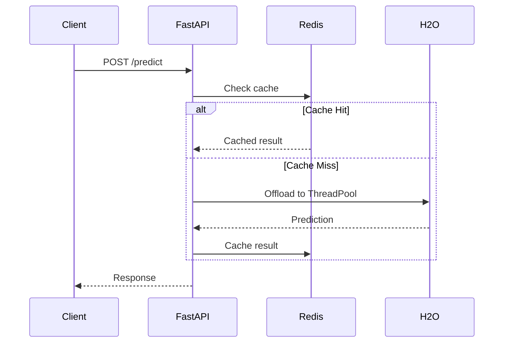

# 4+1 Architectural Views Template

Decomposition template for distributed Data & ML platforms.

---

## Project: {{ project_name }}

### Overview
{{ brief_description }}

---

## Logical View (LOG)

**Focus**: Data structures, schemas, object interactions

### Entities

| Entity | Description | Storage |
|--------|-------------|---------|
| {{ entity_name }} | {{ description }} | Relational / JSONB |

### Schema Design

**Pattern**: Hybrid Schema (Relational + JSONB)

```sql
-- Entity Layer (Relational)
CREATE TABLE entities (
    entity_id UUID PRIMARY KEY,
    created_at TIMESTAMPTZ NOT NULL DEFAULT NOW(),
    segment VARCHAR(50)
);

-- Feature Layer (JSONB)
CREATE TABLE features (
    entity_id UUID REFERENCES entities(entity_id),
    event_time TIMESTAMPTZ NOT NULL,
    feature_vector JSONB NOT NULL
);

-- GIN Index for JSONB queries
CREATE INDEX idx_features_vector ON features USING GIN (feature_vector);
```

### Abstractions

| Component | Interface | Implementation |
|-----------|-----------|----------------|
| Mage Block | Input/Output Schema | `PostgresLoader`, `FeatureTransformer` |
| Feature Contract | Pydantic Model | Shared across producer/consumer |

### Dialectical Decision

```
THESIS:     {{ initial_approach }}
ANTITHESIS: {{ failure_mode }}
SYNTHESIS:  {{ mandated_pattern }}
```

---

## Process View (PROC)

**Focus**: Concurrency, synchronization, data flow

### Concurrency Model

| Task Type | Implementation | Execution Context |
|-----------|----------------|-------------------|
| I/O Bound | `async def + await` | Main Event Loop |
| CPU Bound | `def` (sync) | ThreadPoolExecutor |
| Blocking I/O | `def` (sync) | ThreadPoolExecutor |

### Data Flow



### Caching Strategy

**Pattern**: Look-Aside Cache

1. Calculate `Key = Hash(FeatureVector)`
2. Check `redis.get(Key)`
3. On miss: Compute, then `redis.set(Key, Result, TTL)`

---

## Development View (DEV)

**Focus**: Code structure, artifacts, versioning

### Monorepo Structure

```
src/
├── etl/           # Mage pipelines
│   ├── pipelines/
│   └── blocks/
├── api/           # FastAPI service
│   ├── routers/
│   └── models/
├── ml/            # Training artifacts
│   ├── train.py
│   └── models/
└── shared/        # Cross-cutting concerns
    ├── contracts/
    └── utils/
```

### Artifact Strategy

| Type | Format | Rationale |
|------|--------|-----------|
| ML Models | MOJO (.zip) | Lightweight runtime, no JVM limits |
| Schemas | Alembic migrations | Version-controlled DDL |
| Contracts | Pydantic models | Type safety across services |

### Testing Strategy

| Layer | Tooling | Focus |
|-------|---------|-------|
| Unit | pytest | Pure functions |
| Integration | Testcontainers | Postgres, Redis |
| E2E | pytest + httpx | API flows |

---

## Physical View (PHY)

**Focus**: Infrastructure, deployment, topology

### Container Topology

```
┌─────────────────────────────────────────────────────┐
│                  Kubernetes Cluster                  │
├─────────────────────────────────────────────────────┤
│  ┌──────────────┐  ┌──────────────┐  ┌───────────┐  │
│  │ FastAPI      │  │ H2O Cluster  │  │ Postgres  │  │
│  │ Deployment   │  │ StatefulSet  │  │ Shards    │  │
│  │ (HPA)        │  │ (Headless)   │  │ (Primary+ │  │
│  │              │  │              │  │  Replicas)│  │
│  └──────────────┘  └──────────────┘  └───────────┘  │
├─────────────────────────────────────────────────────┤
│  ┌──────────────┐  ┌──────────────┐  ┌───────────┐  │
│  │ Redis        │  │ Mage         │  │ etcd      │  │
│  │ (Cache)      │  │ (Scheduler)  │  │ (Consensus)│ │
│  └──────────────┘  └──────────────┘  └───────────┘  │
└─────────────────────────────────────────────────────┘
```

### Scaling Configuration

| Service | Resource | Scaling Trigger |
|---------|----------|-----------------|
| FastAPI | Deployment + HPA | CPU >70% or Request Queue |
| H2O | StatefulSet | Manual (cluster size) |
| Postgres | StatefulSet | Manual (shard addition) |
| Redis | Deployment | Memory pressure |

### Memory Management

Formula: `Container_Limit = JVM_Heap + Native_Overhead + Python_Overhead`

Example for 64GB H2O container:
- JVM Heap (`-Xmx`): 40GB (62.5%)
- Native/Python: 24GB (37.5%)

---

## Scenarios View (+1)

**Focus**: Validation through failure scenarios

### Scenario A: {{ scenario_name }}

**Event**: {{ trigger_condition }}

**System Response**:
1. {{ step_1 }}
2. {{ step_2 }}
3. {{ step_3 }}

**Impact**: {{ expected_outcome }}

**Verification**: {{ how_to_test }}

---

### Pre-Defined Scenarios

| ID | Scenario | Expected Recovery Time |
|----|----------|------------------------|
| S-01 | Primary Shard Failure | <30 seconds |
| S-02 | Cache Stampede | No degradation (coalescing) |
| S-03 | H2O Node Crash | Cluster reforms automatically |
| S-04 | Event Loop Blocking | Circuit breaker trips |

---

## View Cross-Reference

| Decision | Logical | Process | Development | Physical | Scenarios |
|----------|---------|---------|-------------|----------|-----------|
| Hybrid Schema | ✓ | | | | |
| Thread Offloading | | ✓ | ✓ | | ✓ |
| MOJO Artifacts | ✓ | | ✓ | | |
| Sharding | ✓ | | | ✓ | ✓ |
| Replication | | ✓ | | ✓ | ✓ |
