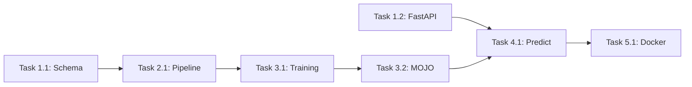

# Implementation Plan: {{ project_name }}

## Overview

{{ project_description }}

---

## Requirements Summary

| Category | Requirement |
|----------|-------------|
| **Functional** | {{ functional_requirements }} |
| **Non-Functional** | {{ non_functional_requirements }} |
| **Constraints** | {{ constraints }} |

---

## Phase 1: Foundation

### Task 1.1: Design Database Schema
- **Assignee**: Database Architect
- **Skill**: `skills/db-architect`
- **Estimated Time**: 10 minutes
- **Files**:
  - `schemas/{{ schema_name }}.json` (CREATE)
  - `schemas/{{ schema_name }}.sql` (CREATE)
- **Dependencies**: None
- **Verification**: 
  - Run `python skills/db-architect/scripts/validate_schema.py schemas/{{ schema_name }}.json`
  - Verify exit code is 0
- **Definition of Done**: 
  - JSON schema passes validation
  - DDL generated successfully
  - All tables have primary keys

### Task 1.2: Scaffold FastAPI Project
- **Assignee**: FastAPI Pro
- **Skill**: `skills/fastapi-pro`
- **Estimated Time**: 5 minutes
- **Files**:
  - `api/main.py` (CREATE)
  - `api/dependencies.py` (CREATE)
  - `api/routers/__init__.py` (CREATE)
- **Dependencies**: None
- **Verification**:
  - Run `python skills/fastapi-pro/scripts/lint_endpoints.py api/`
  - Verify syntax is valid
- **Definition of Done**:
  - Project structure matches template
  - Health endpoint returns 200

---

## Phase 2: Data Engineering

### Task 2.1: Create Mage ETL Pipeline
- **Assignee**: Data Engineer
- **Skill**: `skills/data-engineer`
- **Estimated Time**: 15 minutes
- **Files**:
  - `pipelines/{{ pipeline_name }}/metadata.yaml` (CREATE)
  - `pipelines/{{ pipeline_name }}/data_loaders/` (CREATE)
  - `pipelines/{{ pipeline_name }}/transformers/` (CREATE)
  - `pipelines/{{ pipeline_name }}/data_exporters/` (CREATE)
- **Dependencies**: Task 1.1
- **Verification**:
  - Run `python skills/data-engineer/scripts/validate_pipeline.py pipelines/{{ pipeline_name }}/`
  - Verify no circular dependencies
- **Definition of Done**:
  - Pipeline has loader, transformer, and exporter
  - Passes DAG validation

---

## Phase 3: Machine Learning

### Task 3.1: Create H2O Training Script
- **Assignee**: ML Engineer
- **Skill**: `skills/ml-engineer`
- **Estimated Time**: 10 minutes
- **Files**:
  - `ml/train.py` (CREATE)
  - `ml/config.yaml` (CREATE)
- **Dependencies**: Task 2.1
- **Verification**:
  - Script imports successfully
  - Config file has required fields
- **Definition of Done**:
  - Training script ready for execution
  - MOJO export path configured

### Task 3.2: Validate Initial Model Export
- **Assignee**: ML Engineer
- **Skill**: `skills/ml-engineer`
- **Estimated Time**: 5 minutes
- **Files**:
  - `models/{{ model_name }}.zip` (CREATE)
- **Dependencies**: Task 3.1
- **Verification**:
  - Run `python skills/ml-engineer/scripts/validate_mojo.py models/{{ model_name }}.zip`
- **Definition of Done**:
  - MOJO file validates successfully
  - Model metadata extracted

---

## Phase 4: Serving

### Task 4.1: Implement Prediction Endpoint
- **Assignee**: FastAPI Pro
- **Skill**: `skills/fastapi-pro`
- **Estimated Time**: 10 minutes
- **Files**:
  - `api/routers/predictions.py` (CREATE)
  - `api/models/prediction.py` (CREATE)
- **Dependencies**: Task 1.2, Task 3.2
- **Verification**:
  - Run `python skills/fastapi-pro/scripts/lint_endpoints.py api/`
  - All endpoints have type annotations
- **Definition of Done**:
  - `/predict` endpoint implemented
  - Pydantic models defined
  - Error handling in place

---

## Phase 5: Deployment

### Task 5.1: Create Dockerfile
- **Assignee**: Deployment Engineer
- **Skill**: `skills/deployment-engineer`
- **Estimated Time**: 10 minutes
- **Files**:
  - `Dockerfile` (CREATE)
  - `docker-compose.yml` (CREATE)
  - `.dockerignore` (CREATE)
- **Dependencies**: Task 4.1
- **Verification**:
  - Run `python skills/deployment-engineer/scripts/scan_dockerfile.py Dockerfile`
  - No security errors
- **Definition of Done**:
  - Multi-stage build implemented
  - Non-root user configured
  - Health check defined

---

## Execution Order

---

## Notes

{{ additional_notes }}
