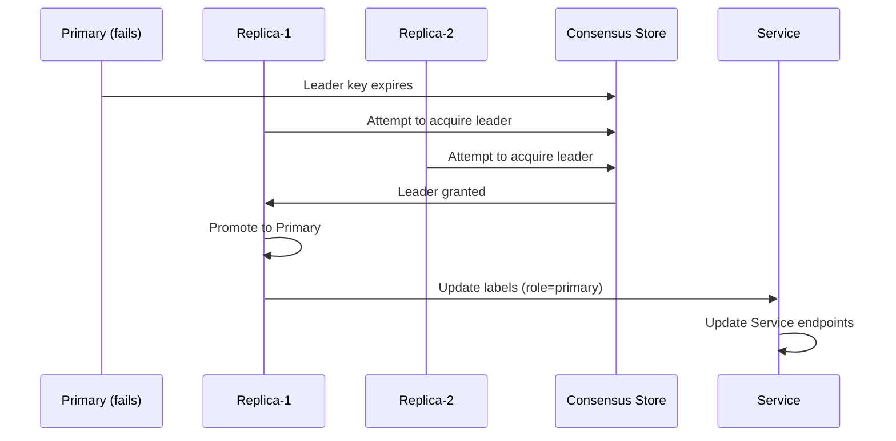

# Failure Modes and Resilience Strategies

Scenarios View (+1) validation template for distributed ML platforms.

---

## Purpose

The Scenarios View validates architecture against critical failure modes:
- Each scenario defines a failure event
- Documents expected system response
- Specifies verification steps

---

## Critical Failure Scenarios

### Scenario A: Primary Shard Failure

**Category**: Data Layer
**Severity**: Critical
**JTBD**: JTBD-04 (Persistence Guarantee)

#### Event
Primary database node of Shard-1 crashes unexpectedly.

#### Detection Mechanism
| Component | Method | Timeout |
|-----------|--------|---------|
| Patroni Agent | Leader key TTL | 10 seconds |
| K8s Liveness | TCP probe | 30 seconds |
| Application | Connection error | Immediate |

#### System Response



1. **Detection** (0-10s): Patroni detects leader timeout
2. **Election** (10-15s): Replicas race for leader key
3. **Promotion** (15-25s): Winner promotes to Primary
4. **Routing** (25-30s): K8s Service endpoints updated

#### Impact Assessment
| Metric | Impact |
|--------|--------|
| Write Downtime | 15-30 seconds |
| Read Availability | Degraded (eventual consistency) |
| Data Loss | Zero (synchronous commit) |

#### Verification Steps
```bash
# 1. Kill primary pod
kubectl delete pod postgres-shard-1-0 --force

# 2. Monitor failover
watch kubectl get pods -l app=postgres

# 3. Verify new primary
kubectl exec postgres-shard-1-1 -- patronictl list

# 4. Verify application reconnection
curl http://api:8000/health
```

---

### Scenario B: Cache Stampede (Thundering Herd)

**Category**: Inference Layer
**Severity**: High
**JTBD**: JTBD-02 (Inference Scaling)

#### Event
Popular feature vector cache key expires; 1000 concurrent requests arrive.

#### Risk Analysis
| Without Mitigation | With Mitigation |
|-------------------|-----------------|
| All 1000 requests hit ML model | Single request computes |
| CPU spike, potential OOM | Controlled load |
| p99 latency spikes to seconds | p99 remains <50ms |

#### Mitigation Strategy: Request Coalescing

```python
import asyncio
from typing import Dict, Any

# In-flight request tracking
pending_requests: Dict[str, asyncio.Future] = {}

async def get_prediction_with_coalesce(key: str, features: dict) -> dict:
    # Check if request already in-flight
    if key in pending_requests:
        return await pending_requests[key]
    
    # Create future for this request
    future = asyncio.get_event_loop().create_future()
    pending_requests[key] = future
    
    try:
        # Check cache
        cached = await redis.get(key)
        if cached:
            future.set_result(cached)
            return cached
        
        # Compute prediction
        result = await compute_prediction(features)
        
        # Cache and return
        await redis.set(key, result, ex=300)
        future.set_result(result)
        return result
    finally:
        del pending_requests[key]
```

#### Alternative: Probabilistic Early Expiration
```python
def should_refresh(remaining_ttl: int, total_ttl: int) -> bool:
    """Probabilistically refresh before expiry."""
    if remaining_ttl > total_ttl * 0.1:
        return False
    probability = 1 - (remaining_ttl / (total_ttl * 0.1))
    return random.random() < probability
```

#### Verification Steps
```bash
# 1. Set cache key with short TTL
redis-cli SET test_key "value" EX 5

# 2. Generate concurrent requests at expiry
ab -n 1000 -c 100 http://api:8000/predict?key=test_key

# 3. Monitor model compute count (should be 1)
grep "Computing prediction" /var/log/app.log | wc -l
```

---

### Scenario C: Event Loop Blocking

**Category**: API Layer
**Severity**: High
**JTBD**: JTBD-02 (Inference Scaling)

#### Event
CPU-bound inference accidentally executed in event loop context.

#### Symptoms
| Metric | Normal | Blocked |
|--------|--------|---------|
| p50 Latency | 5ms | 50ms |
| p99 Latency | 20ms | 2000ms |
| Throughput | 1000 req/s | 10 req/s |

#### Detection
```python
# Middleware to detect blocking
import time

class BlockingDetectorMiddleware:
    async def __call__(self, request, call_next):
        start = time.monotonic()
        response = await call_next(request)
        duration = time.monotonic() - start
        
        if duration > 0.1:  # 100ms threshold
            logger.warning(f"Potential blocking detected: {duration:.2f}s")
        
        return response
```

#### Prevention: Circuit Breaker

```python
from datetime import datetime, timedelta

class InferenceCircuitBreaker:
    def __init__(self, max_queue_depth: int = 50, cooldown_seconds: int = 30):
        self.max_queue = max_queue_depth
        self.cooldown = timedelta(seconds=cooldown_seconds)
        self.queue_depth = 0
        self.tripped_at: datetime | None = None
    
    def is_open(self) -> bool:
        if self.tripped_at:
            if datetime.now() - self.tripped_at < self.cooldown:
                return True
            self.tripped_at = None
        return False
    
    async def call(self, func, *args):
        if self.is_open():
            raise ServiceUnavailable("Circuit breaker open")
        
        if self.queue_depth >= self.max_queue:
            self.tripped_at = datetime.now()
            raise ServiceUnavailable("Queue depth exceeded")
        
        self.queue_depth += 1
        try:
            return await func(*args)
        finally:
            self.queue_depth -= 1
```

---

### Scenario D: H2O Cluster Partition

**Category**: ML Training Layer
**Severity**: Medium
**JTBD**: JTBD-01 (Stack Decomposition)

#### Event
Network partition separates H2O nodes during training.

#### H2O Behavior
- H2O uses in-memory distributed key-value store (DKV)
- Split-brain causes inconsistent state
- Training job fails or produces corrupt model

#### Mitigation
```yaml
# Kubernetes NetworkPolicy for H2O
apiVersion: networking.k8s.io/v1
kind: NetworkPolicy
metadata:
  name: h2o-cluster-network
spec:
  podSelector:
    matchLabels:
      app: h2o
  ingress:
    - from:
        - podSelector:
            matchLabels:
              app: h2o
      ports:
        - port: 54321
        - port: 54322
```

#### Recovery
```python
# In Mage training block
try:
    h2o.init(url="http://h2o-headless:54321")
    model = train_model()
except H2OConnectionError:
    # Restart cluster formation
    restart_h2o_cluster()
    h2o.init(url="http://h2o-headless:54321")
    model = train_model()
```

---

## Failure Scenario Template

### Scenario {{ ID }}: {{ Title }}

**Category**: {{ Data/API/ML/Infrastructure }}
**Severity**: {{ Critical/High/Medium/Low }}
**JTBD**: {{ Related job }}

#### Event
{{ Describe the failure trigger }}

#### Detection
| Component | Method | Timeout |
|-----------|--------|---------|
| {{ }} | {{ }} | {{ }} |

#### System Response
1. {{ Step 1 }}
2. {{ Step 2 }}
3. {{ Step 3 }}

#### Impact
| Metric | Impact |
|--------|--------|
| {{ }} | {{ }} |

#### Mitigation
{{ Code or configuration }}

#### Verification
```bash
{{ Test commands }}
```

---

## Resilience Checklist

- [ ] All critical scenarios documented
- [ ] Detection mechanisms configured
- [ ] Automated recovery implemented
- [ ] Verification tests passing
- [ ] Runbooks written for manual intervention
