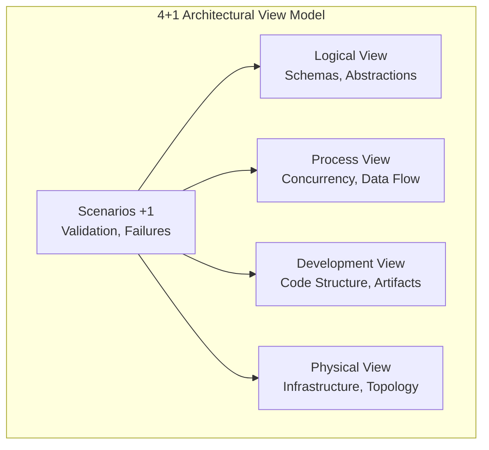
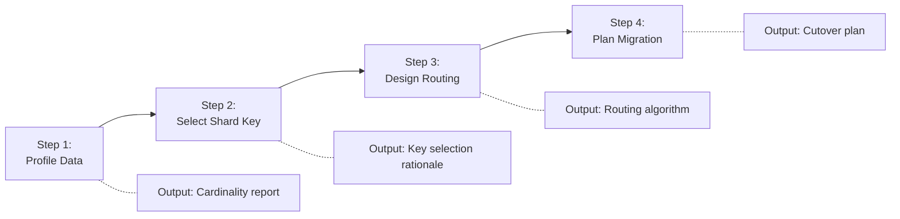
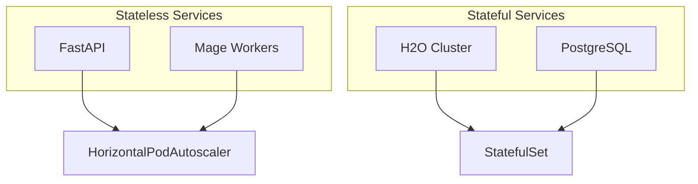

# Cognitive Superpowers Reference

Detailed documentation for the three core reasoning capabilities of the Architectural Planner.

---

## Overview

| Superpower | Purpose | Application |
|------------|---------|-------------|
| **Writing-Plans** | Structure complex systems | 4+1 View Decomposition |
| **Sequential-Thinking** | Solve multi-step problems | Sharding, Migration |
| **Scalability Planning** | Design for growth | Horizontal scaling strategy |

---

## Writing-Plans (4+1 View Decomposition)

### Definition
The ability to structure complex information into coherent, executable hierarchies using the 4+1 Architectural View Model.

### The 4+1 Views



### View Responsibilities

| View | Focus Area | Key Questions |
|------|------------|---------------|
| **Logical** | What entities exist? | "How does data flow between components?" |
| **Process** | How do they interact? | "What happens under concurrency?" |
| **Development** | How is it organized? | "How are artifacts versioned?" |
| **Physical** | Where does it run? | "How is it deployed at scale?" |
| **Scenarios** | Does it work? | "What happens when X fails?" |

### Prevention of Tunnel Vision

Writing-Plans prevents isolated thinking by requiring cross-view validation:

```
Example: Library selection in Development View

Question: "Should we use library X?"

Development View: Libraries X is well-maintained
Physical View:    Library X requires 2GB memory
                  → Container limit is 512MB
                  → REJECTED

Without cross-view validation, this conflict would surface in production.
```

### JTBD Mapping
- **Primary Job**: JTBD-01 (Stack Decomposition)
- **Target Views**: Logical, Development

---

## Sequential-Thinking (Multi-Step Problem Solving)

### Definition
The capacity to break down problems where the output of step N is the rigid input for step N+1. Prerequisites must be satisfied before proceeding.

### Characteristics

| Property | Description |
|----------|-------------|
| **Ordered** | Steps must execute in sequence |
| **Dependent** | Output of step N feeds step N+1 |
| **Gated** | Failures at step N block all subsequent steps |
| **Traceable** | Each step has verifiable outputs |

### Canonical Example: Database Sharding



### Step Details

#### Step 1: Profile Data
**Input**: Table statistics, query logs
**Process**: Analyze cardinality, distribution, access patterns
**Output**: Cardinality report with hotspot analysis
**Gate**: Cannot proceed without data volume metrics

#### Step 2: Select Shard Key
**Input**: Cardinality report
**Process**: Evaluate candidate columns against criteria
**Output**: Selected key with rationale
**Gate**: Cannot proceed without high-cardinality immutable candidate

#### Step 3: Design Routing
**Input**: Selected shard key
**Process**: Design hash function, middleware placement
**Output**: Routing algorithm specification
**Gate**: Cannot proceed without deterministic routing logic

#### Step 4: Plan Migration
**Input**: Routing algorithm
**Process**: Design dual-write, backfill, cutover strategy
**Output**: Migration runbook
**Gate**: Cannot proceed without rollback plan

### Anti-Pattern: Skipping Steps

```
WRONG: "Let's just hash by entity_id and start sharding"

Problem: Without Step 1 (Profile Data), you might:
- Choose a low-cardinality key → Hotspots
- Choose a mutable key → Row migration overhead
- Underestimate data volume → Insufficient shards
```

### JTBD Mapping
- **Primary Job**: JTBD-03 (Shard Feature Store)
- **Target Views**: Logical, Physical

---

## Scalability Planning (Horizontal Scaling Strategy)

### Definition
The foresight to design systems that absorb growth through resource addition (scale-out) rather than hardware upgrades (scale-up).

### Scaling Categories



### Stateless vs Stateful Patterns

| Aspect | Stateless | Stateful |
|--------|-----------|----------|
| **State Location** | External (DB, Cache) | Internal (memory, disk) |
| **Pod Identity** | Interchangeable | Stable (h2o-0, h2o-1) |
| **Scaling** | Instant | Requires coordination |
| **K8s Resource** | Deployment + HPA | StatefulSet |
| **Example** | FastAPI | H2O, PostgreSQL |

### Bottleneck Anticipation

Scalability Planning requires identifying bottlenecks BEFORE they occur:

| Resource | Bottleneck | Pre-emptive Mitigation |
|----------|-----------|------------------------|
| Database connections | max_connections=100 | PgBouncer pool |
| Event loop | CPU-bound blocking | ThreadPoolExecutor |
| Memory | JVM heap growth | Container limits, -Xmx |
| Cache | Key expiration stampede | Probabilistic refresh |

### Capacity Planning Formula

```python
# Inference Service Sizing
target_throughput = 1000  # req/s
per_pod_capacity = 100    # req/s (measured)
safety_factor = 1.5

required_pods = math.ceil(target_throughput / per_pod_capacity)
max_pods = int(required_pods * safety_factor)

# HPA Configuration
hpa_config = {
    "minReplicas": max(3, required_pods // 2),
    "maxReplicas": max_pods,
    "targetCPU": 70
}
```

### JTBD Mapping
- **Primary Jobs**: JTBD-02 (Scale Inference), JTBD-04 (Ensure Persistence)
- **Target Views**: Process, Physical

---

## Superpower Selection Guide

When facing an architectural challenge, select the appropriate superpower:

| Challenge Type | Superpower | Example |
|----------------|------------|---------|
| "Decompose this system" | Writing-Plans | Define all views for new microservice |
| "How do we migrate data?" | Sequential-Thinking | Plan database sharding strategy |
| "Will this handle 10x load?" | Scalability Planning | Design autoscaling for inference |
| "What if component X fails?" | Writing-Plans (Scenarios) | Document failover behavior |

---

## Integration with Dialectical Reasoning

Each superpower should be informed by dialectical analysis:

```
Step: Select Shard Key (Sequential-Thinking)

THESIS:     Use entity_id (high cardinality)
ANTITHESIS: What if entity_id changes? (Row migration)
SYNTHESIS:  entity_id is immutable by design → PROCEED
```

This integration ensures superpowers produce defensible outputs.
